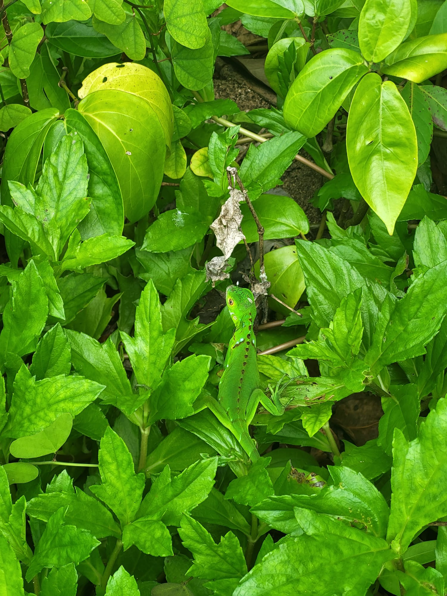

# Semestre de Intercambio en Costa Rica

Autor: *Theresia*  
Fecha: *12.09.2023*

## Motivos
- Desarrollo personal profesional y privada
  
- Asistir a cursos que no se imparten en mi universidad de origen  y que me permiten comprender la influencia del clima tropico de Costa Rica en los planteamientos de ejecución de proyectos
  
- Mejorar mi español
  
- Vivir en el extranjero y conocer otra cultura
  
## Informe de Experiencia: El Primer Mes

### Idioma

Aunque había hablado algo de español anteriormente, estudiar en español resulta especialmente desafiante. Sobre todo, encuentro que las clases de 3 horas son difíciles debido al contenido y a la barrera del idioma, además del contenido exigente. Me doy cuenta de que mi comprensión mejora cada día, pero incluso después de más de un mes, aún me cuesta hablar con fluidez o confianza. Estoy considerando la posibilidad de asistir a una escuela de idiomas adicionalmente para mejorar mis habilidades. Lamentablemente, he aceptado con muchas veces la oferta de cambiar al inglés, y me gustaría hacerlo solo en situaciones de emergencia en los próximos meses. 

### Universitdad

Desde mediados de augosto, estoy asistiendo a la [***Universidad de Costa Rica (UCR)***](https://www.ucr.ac.cr/) en San José. El campus de la universidad es muy hermoso y ofrece muchas oportunidades. La forma de enseñanza en esta universidad es muy diferente de la de Alemania. Las clases son considerablemente más pequeñas aquí y la comunicación es mucho más personal, lo que incluso incluye el uso de WhatsApp, algo impensable en Alemania. Mientras que en Alemania, generalmente, un examen final o una tesis representan el 100% de la calificación al final del semestre, aquí en todos los cursos debemos realizar tareas regulares que se suman a la calificación final, además de los exámenes. Para enviar estas tareas, utilizamos la plataforma *MediacionVirtual*.

### Vida

Mi experiencia aquí en San José, Costa Rica, es única. Aunque la comida puede ser costosa, la diversidad de sabores es fascinante, espacielamente las frutas diferentes me gustan muchas. A mi, el clima es un equilibrio perfecto; las mañanas soleadas y las tardes con lluvia son ideales.
La hospitalidad y la amabilidad de los costarricenses son inigualables. Y la música aquí mucho mejor que en Alemania.
Aunque aún no me acostumbro completamente a los infaltables arroz y frijoles en todas sus variaciones, la comida en general es deliciosa. Además, la cantidad de parques nacionales y bellezas naturales cercanas es asombrosa. He tenido la oportunidad de visitar el Volcán Poás ***(Foto 1)***, el Parque nacional Cahuita ***(Foto 2)*** y la hermosa Puerto Viejo en el Caribe.
En resumen, vivir en San José, Costa Rica, es una aventura emocionante llena de sabores, música y belleza natural. Estoy agradecido por esta experiencia única y emocionado por lo que los próximos meses me deparan.

**Foto 1: Volcán Poás** (Fotografía tomada el 13 de agosto, 2023)


[Aprende más sobre el *Parque Nacional Poás*](https://es.wikipedia.org/wiki/Parque_nacional_Volc%C3%A1n_Po%C3%A1s)


**Foto 2: Iguana pequeña en el Parque nacional Cahuita** (Fotografía tomada el 26 de agosto, 2023)



[Aprende más sobre el *Parque nacional Cahuita*](https://es.wikipedia.org/wiki/Parque_nacional_Cahuita)


## Objetivos

1. Hablar español con fluidez.
2. Completar con éxito mis cursos universitarios.
3. Adquirir nuevas habilidades, especialmente en el área de gestión de inundaciones en los trópicos.
4. Hacer amigos locales.
5. Realizar excursiones en la hermosa naturaleza de Costa Rica


```python

```
